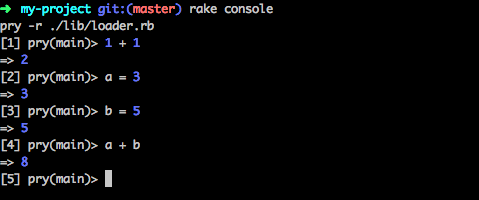
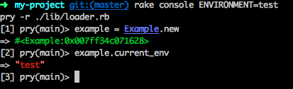
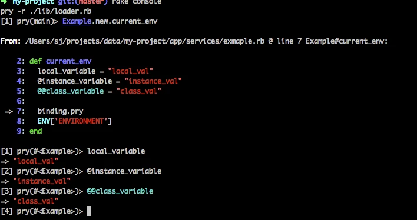
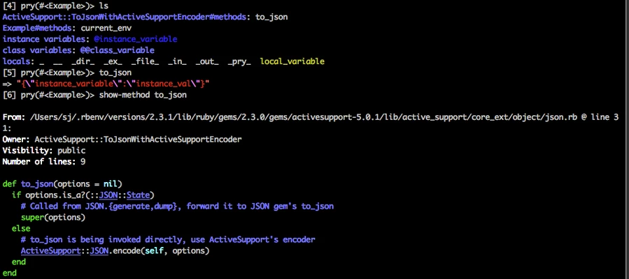
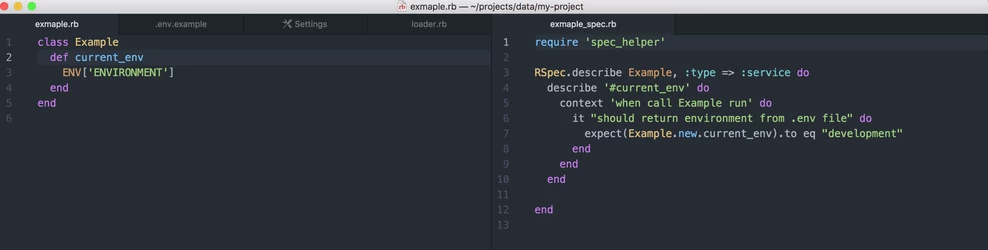
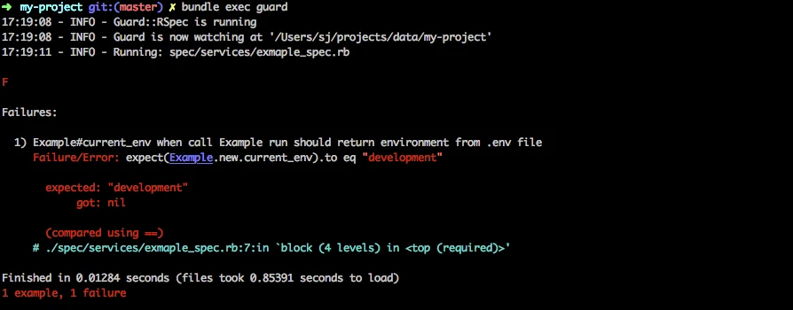
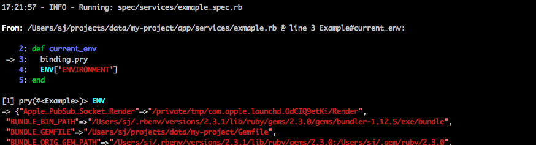

루비는 인터프리터 언어입니다. 컴파일 언어와 IDE를 먼저 접한 분들은 디버깅하는 방식이 달라서 처음에 낯설어 하는 경우가 있는데요, 인터프리터 언어는 컴파일 언어와 조금 다르게 디버깅합니다.
ps. Ruby를 설치하는 방법은 따로 설명하지 않겠습니다. rbenv와 ruby-build를 이용해 직접 설치하시거나 Docker 또는 Mac에 있는 기본 루비를 사용해주세요.

## Base Project 다운받기
1. 기본적인 프로젝트 구조를 만든 프로젝트(https://github.com/rubydoc/ruby_base_project) 를 clone해주세요.
```
  git clone https://github.com/rubydoc/ruby_base_project my-project`
  cd my-project
```
2. bundle install 을 실행해 Gemfile에 있는 Gem을 설치해주세요, Gem은 루비 라이브러리입니다. Gemfile에 있는 것들은 bundler라는 Gem에 의해 라이브러리들이 설치됩니다.
```
bundle install
```

## Console에서 디버깅하기
Ruby 개발자들은 Interactive Ruby Shell 에서 코드를 테스트하면서 디버깅을 합니다. 루비를 설치하면 기본적으로 irb가 설치가 되지만 Base Project에 pry라는 더 나은 쉘이 포함되어있습니다. Rake console을 실행하면 pry쉘을 이용할 수 있습니다. lib/loader.rb에 모든 app의 파일들은 자동으로 load하도록 해두었기 때문에 app 하단의 class들은 따로 import와 같은 작업을 할 필요없이 사용하실 수 있습니다.


다음과 같이 기본 루비 코드부터

/app 폴더내의 class와 instance를 마음껏 테스트해 볼 수 있습니다. 인터프리터 언어의 장점중에 하나는 코드를 바로 실행해보고 결과를 볼 수 있다는 점인데요. 컴파일 언어에 비해 Trial & Error의 피드백을 더 빨리 받을 수 있습니다.

## Debugger 이용하기
Gemfile에 포함된 pry와 byebug gem을 이용하면 원하시는 곳에서 실행을 멈추고 pry 쉘을 열어서 바로 코드를 테스트해볼 수 있습니다. 멈추기를 원하는 곳에 binding.pry를 타이핑하고 console에서 해당 코드를 호출해보세요.


해당 method block에서 접근할 수 있는 모든 객체 및 class들의 값들을 바로 확인할 수 있습니다. 심지어 여기서 코드를 작성하고 테스트 할 수 있습니다.
그리고 ls를 통해 현재 범위의 변수들 또는 객체 내부를 볼 수 있고, show-method를 통해 method가 어떻게 구현되어있는지를 집접 확인할 수 있습니다.

이렇게 하거나


이렇게요. IDE의 도움이나 문서를 보지 않고도 특정 클래스, 객체의 사용법을 알 수 있습니다.

## TDD로 디버깅하기
유닛 테스트와 같이 디버깅을 하면 준비된 파라미터로 즉시 테스트 할 수 있습니다. atom 에디터의 rails open rspec을 설치하면 alt+cmd+o 버튼을 눌러 해당파일의 spec파일을 바로 열 수 있습니다.


bundle exec guard를 치면 Guard가 실행됩니다. Guard는 변경된 파일의 unit test 코드를 자동으로 실행시켜줍니다. Test Code는 Rspec으로 작성했습니다. Rspec과 낯설다면 http://www.betterspecs.org/ko/ 를 통해 배울 수 있습니다.

파일을 변경하거나 엔터를 치면 Spec이 자동으로 실행됩니다. Example#current_env가 실패하였습니다.
원인을 파악하기 위해 debugger를 넣으면 console에서 작업했던 것과 동일하게 Interactive하게 Code를 테스트해 볼 수 있습니다.


ENV["ENVIRONMENT"]가 없음을 확인했습니다. .env파일이 없기 때문입니다. .env파일은 서버별로 다른 값을 가지고 있거나 소스코드에 커밋하면 안되는 보안관련된 값을 저장하는데 주로 쓰입니다. .env는 git에 의해 관리되고 있지 않기 때문에 .env.example을 참고하여 업데이트합니다. cp .env.example .env 를 실행하고 다시 Guard를 실행해봅니다.

테스트가 통과했습니다!

## Summary
정적 언어와 IDE에 익숙한 사람들은 동적언어로 코딩하는데 낯설음을 느낍니다. 디버거를 지원하는 IDE도 많지 않고 타입이 없어 안정감이 없다고 생각할 수 있습니다. 동적언어는 메타프로그램, 덕타이핑과 같은 추상화 방식을 쓸 수 있고, 디버거를 찍어 코드를 테스트하고 바로 에디터에 붙여넣어 확인할 수 있습니다. 컴파일 시간을 기다리지 않고 매우 짧은 시간 내에 피드백을 받을 수 있습니다.

최근에는 Scala와 같은 정적언어에서 인터프리터를 지원하고, 동적 언어인 Javascript에서 정적언어의 이점을 얻기 위해 Type을 선언(Typescript)하기도 합니다. 앞으로 동적언어, 정적언어와 같은 구분이 더 의미가 없어질 수 있습니다.

하지만 지금, 그리고 한동안은 정적언어의 이점과 동적언어의 이점과 디버깅 방식의 차이를 이해하고 어떤 언어/도구가 생산성에 도움이 되는지 판단하는 것도 중요하다고 생각합니다. Ruby에 대해 잘 모르시는 분들은 Ruby 디버깅 글을 보시고 지금 사용하시는 Workflow와 비교해 볼 수 있도록 글을 작성했습니다.
