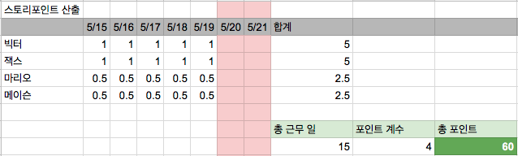
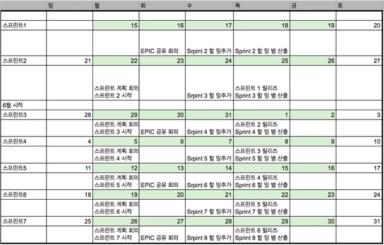

일반적인 내용은 [스크럼위키](https://ko.wikipedia.org/wiki/%EC%8A%A4%ED%81%AC%EB%9F%BC_(%EC%95%A0%EC%9E%90%EC%9D%BC_%EA%B0%9C%EB%B0%9C_%ED%94%84%EB%A1%9C%EC%84%B8%EC%8A%A4))를 참조하시면 됩니다. 스크럼은 작은 프로세스지만 QA, Release, 기획과 결합하다 보면 복잡한 상호작용이 많이 생깁니다. 특히 Jira와 회사의 환경에 맞춰 설명을 합니다.
## 참여자
* 개발자 - 스크럼에서 개발을 담당합니다. 사전에 스크럼을 진행할 일들의 일정을 산출하고, 카드를 완료하여 QA에게 넘기는 일을 합니다.
* 스크럼 마스터 - 스크럼의 진행을 돕는 사람. 스크럼이 제 시간내에 끝낼 수 있도록 상호작용을 하고 진행이 불가능한 경우 스크럼을 멈추고 긴급한 일을 하도록 하기도 합니다.
* 프러덕트 오너 - 제품의 우선순위를 정하는 사람. 이해관계자들의 요구사항을 조절하는 역할을 합니다.
* 이해관계자(기획/기능제공자) - 개발팀에 요구사항이 있는 사람, 기획자, 마케팅팀원, CEO 등 모든 사내의 개발요청이 있는 사람
* QA - 테스트/품질을 책임지는 사람, 사실은 리암

## 진행순서 - 1주일로 가정
1. EPIC 회의 - 프러덕트 오너는 EPIC회의를 소집하여 큰 기능 집합의 Milestone을 공유합니다.
  * 예시
    * Sprint-1에서는 학원은 랜딩을 개선합니다.
    * Sprint-2에서는 학원의 디테일 및 피드의 디테일 페이지를 개선합니다.
    * Srpint-3에서는 결제 기능을 구현합니다.
2. 스프린트 계획
  * 개발자/프러덕트 오너는 다음 스프린트에 할 일을 추가합니다.
  * 이해관계자는 프러덕트 오너와의 상의를 통해서 스프린트에 할 일 카드를 추가합니다.
  * 개발자들은 작업에 걸리는 시간을 산정합니다. 카드의 내용을 이해 못하는 경우 카드 작성자에게 물어봅니다.
    * 각자 자기가 할 만한 카드들을 산정합니다.
    * 스크럼 마스터는 아무도 산정하지 않은 카드들은 산정할 수 있도록 팀원들에게 요구합니다.
  * PO는 우선순위대로 산정한 카드들을 정렬합니다.
  * 스프린트 계획회의를 통해 할 일을 결정합니다. 회의에는 QA를 제외한 모든 사람이 참가합니다.
    * 스크럼 마스터는 기존에 남아있는 일들을 정리하여 새 스프린트로 넘깁니다.
    * 팀원들의 근무일정을 체크하여 할 수 있는 총 스토리포인트를 산정합니다.
    * PO/이해관계자들과 협의를 통해서 스토리포인트를 초과하는 일들을 제거합니다. 주도권은 PO에게 있습니다.
    * 다음 스프린트를 출발합니다.

3. 스프린트
  * QA는 다음 릴리즈에 꼭 필요한 일들은 릴리즈 버전을 표시를 합니다.
  * 릴리즈에 필요한 버그를 우선순위로 처리합니다.
  * 카드를 주도적으로 가져와서 일을 합니다.
  * 매일 데일리 싱크를 통해서 할 일이 얼마나 남았고 자신의 일이 block되거나 생각보다 늦어진 경우 공유합니다. 자신의 일이 먼저 끝나면 돕습니다.
  * 카드에 없는 일은 버그를 제외하고는 하지 않습니다.
  * 너무 큰 일이 스프린트에 추가되는 경우 스프린트를 깨고 다시 시작합니다.
4. 회고
  * 좋았던 점, 나빴던 점, 개선할 방법을 이야기합니다.

## 포인트 산출

## 스프린트 일정

